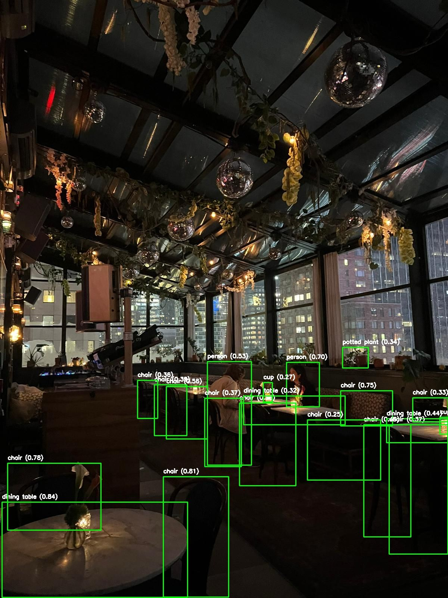
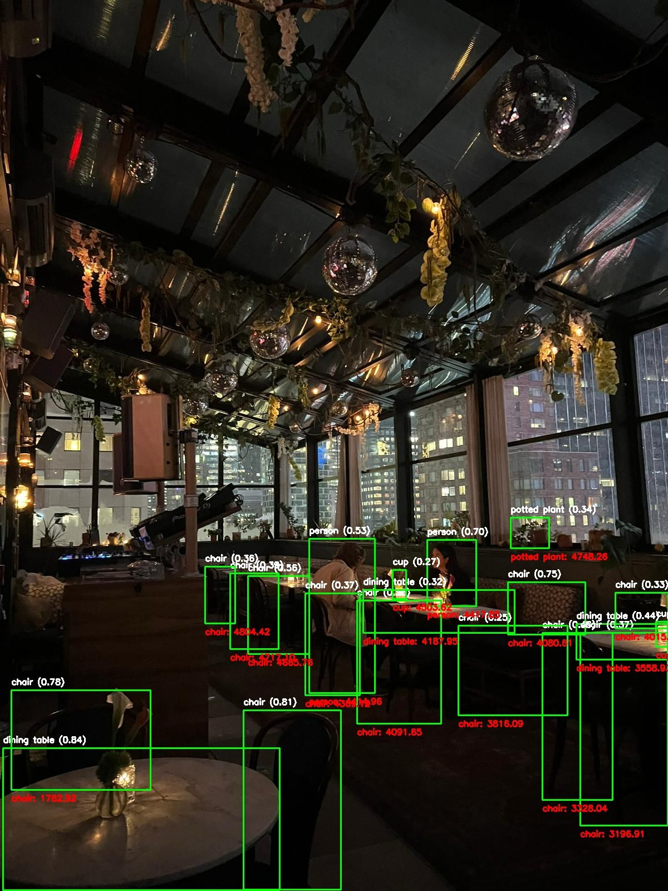

**Vision Aid** is a project developed as part of an **Introduction to Machine Learning** class. Its main goal is to assist visually impaired users in understanding their surroundings. It does this by integrating object detection (using YOLOv5), depth estimation (using MiDaS), and a language model (GPT) to produce a clear, auditory-friendly description of a scene. By providing spatial cues like "to the left," "to the right," "closer," and "farther," the system helps users build a mental picture of their environment.

## Table of Contents
- [Overview](#overview)
- [Key Features](#key-features)
- [How It Works](#how-it-works)
  - [Step 1: Upload and Display the Original Image](#step-1-upload-and-display-the-original-image)
  - [Step 2: Object Detection with YOLOv5](#step-2-object-detection-with-yolov5)
  - [Step 3: Depth Estimation with MiDaS](#step-3-depth-estimation-with-midas)
  - [Scene Description via GPT](#scene-description-via-gpt)
- [Dependencies and Installation](#dependencies-and-installation)
- [Running the Application](#running-the-application)
- [The Prompt Explained](#the-prompt-explained)
- [Relevant Links & References](#relevant-links--references)
- [Future Work](#future-work)
- [License](#license)

## Overview

Vision Aid combines three key technologies:
1. **Object Detection**: [YOLOv5](https://github.com/ultralytics/yolov5) identifies objects in the scene.
2. **Depth Estimation**: [MiDaS](https://github.com/intel-isl/MiDaS) estimates the relative distances of those objects.
3. **Language Generation**: OpenAI's GPT models produce a spatially aware, intuitive description of the scene, avoiding technical terms.

## Key Features

- **Step-by-Step Visualization**: The `steps.py` script shows the pipeline—from raw input image to detected objects, then to depth estimation.
- **Real-Time Processing**: The `app.py` script handles both video files and live streams, detecting objects and estimating depth in real-time.
- **Auditory-Friendly**: The final scene description is generated in natural language and can be spoken aloud to help visually impaired users.


**Key Files**:
- `app.py`: Main Streamlit app for real-time analysis (video feed or uploaded video).
- `steps.py`: Walk-through of the image processing pipeline step-by-step.
- `yolov5s.pt`: Pretrained YOLOv5 weights.
- `uploaded_video.mp4`, `test.png`, `test2.png`, `test3.png`, `test4.png`: Sample files for testing and demonstration.

## How It Works

### Step 1: Upload and Display the Original Image

You upload an image. The system displays the untouched original image.

**Placeholder for Step 1 Image**:  


### Step 2: Object Detection with YOLOv5

The uploaded image is passed through YOLOv5, detecting objects and returning bounding boxes with labels.

**What’s Happening**:
- YOLOv5 identifies objects like `person`, `car`, `bottle`, etc.
- Draws bounding boxes and labels on the image.

**Placeholder for Step 2 Image**:  


### Step 3: Depth Estimation with MiDaS

The image is then sent to the MiDaS model to produce a depth map, where closer objects appear lighter and distant objects darker.

**What’s Happening**:
- MiDaS estimates relative depth.
- Depth map helps visualize which objects are nearer or farther.

**Placeholder for Step 3 Image**:  


**Combining Object Detection + Depth**:  
We combine the bounding boxes with depth information to understand the scene spatially.

**Placeholder for Combined Image**:  


### Scene Description via GPT

All object positions and relative depths are summarized and sent to GPT. GPT returns a concise, spatially-aware narrative. For example:

> "A car appears to the left, while a person stands closer to the right. A sign is visible farther behind."

## Dependencies and Installation

**Prerequisites**:
- Python 3.7+
- `pip` or `conda`
- GPU recommended for performance

**Install Dependencies**:
```bash
pip install -r requirements.txt
